# Operationalizing Machine Learning

In this project, a cloud-based machine learning production model is configured, deployed, and consumed in Azure. Furthermore a pipeline is created, published, and consumed.
A bank marketing dataset from https://www.kaggle.com/datasets/janiobachmann/bank-marketing-dataset is used for the model training.

## Architectural Diagram
The following steps are performed:

1. Authentication
2. Automated ML Experiment
3. Deploy the best model
4. Enable logging
5. Swagger Documentation
6. Consume model endpoints
7. Create and publish a pipeline
8. Documentation

## Key Steps
### 1. Authentication

   The project lab is used to complete the project. Therefore this step is skipped since I am not authorized to create a security principal.

### 2. Automated ML Experiment

   Azure Machine Learning GUI is used to create a new automated ML run.
   
   #### 2.1. Basic settings
   - Experiment name is defined at the step of "Basic Settings"
     
     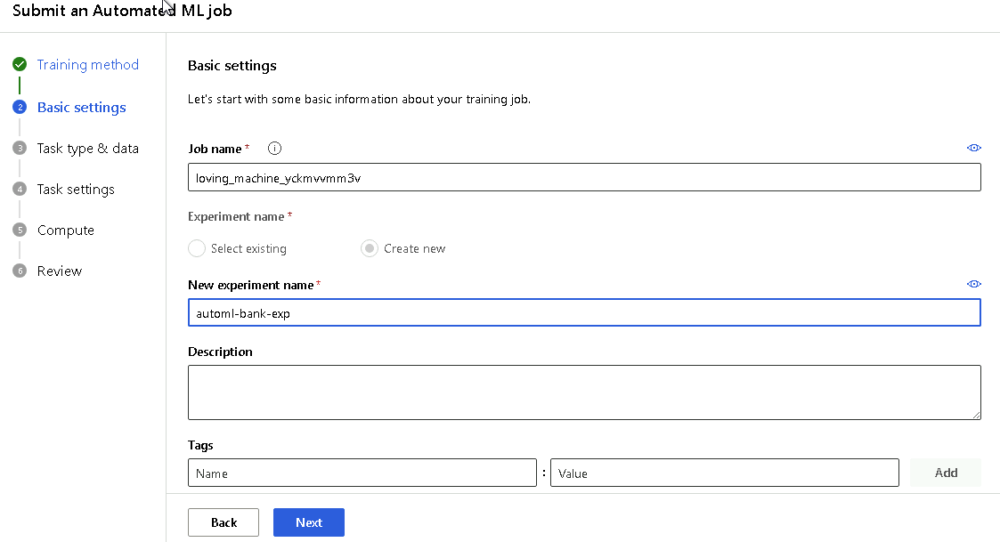

   #### 2.2. Task type and data
   - Task type is selected as classification.
   - The data asset is registered by locally uploading the csv file from https://www.kaggle.com/datasets/janiobachmann/bank-marketing-dataset
     
     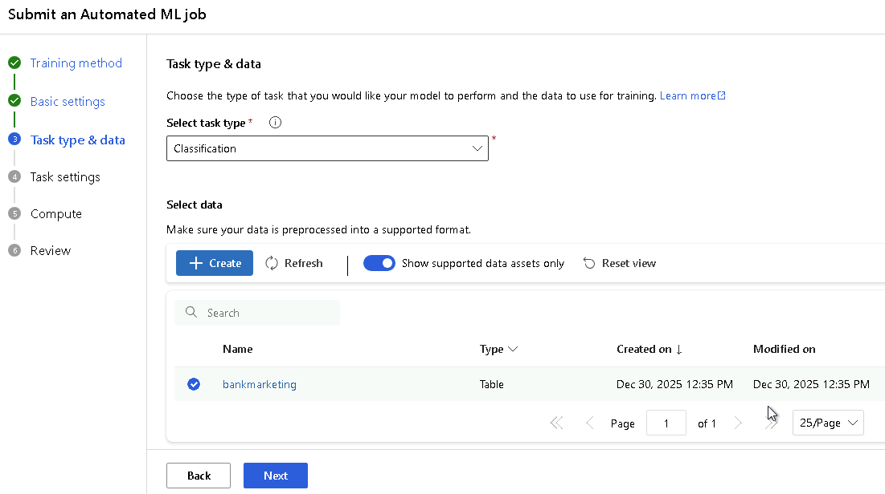

   #### 2.3. Task settings
   - The target column is selected as "deposit"
     
     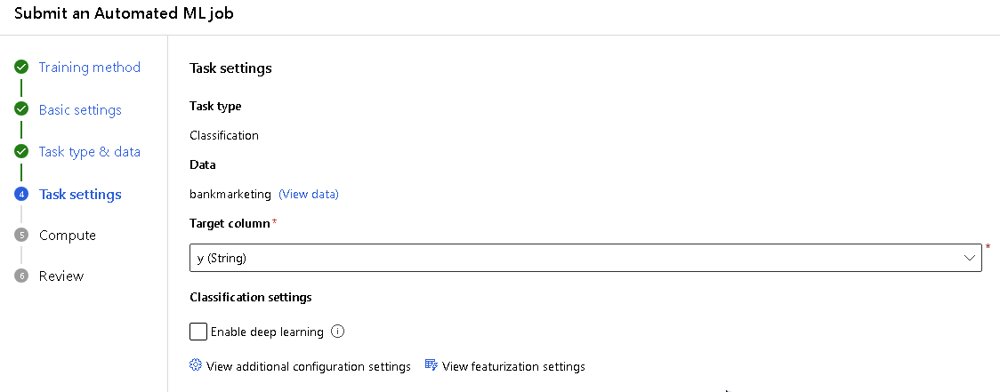

   - Additional configuration settings is done by
     - selecting "Primary metric" as "Accuracy"
     - checking "Explain best model" is enabled
       
       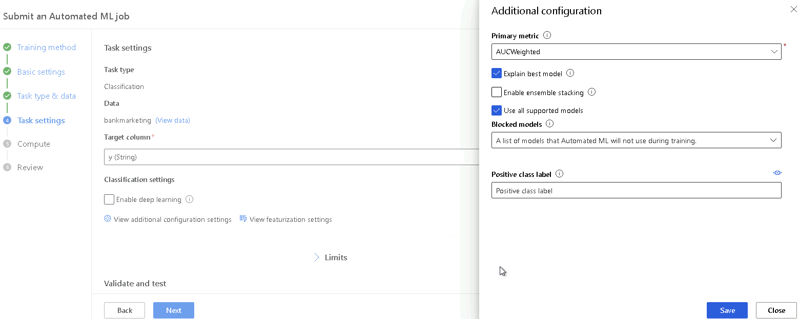
     
   - Limits are set as follows:
     - max trials = 25
     - max concurrent trials = 5 as expected from the objectives of the project
     - max nodes = 6
     - experiment timeout = 60 mins (1 hours) as expected from the objectives of the project
     - iteration timeout = 15 as minumum recommended duration by Azure ML studio
       
       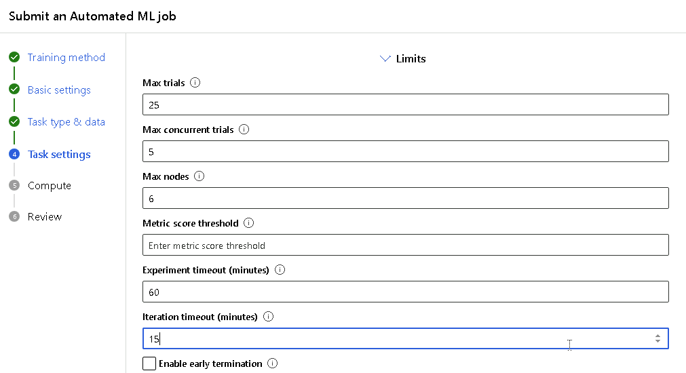

   - Validate and test data section are configured as explained in the related lesson
     - Validation type is selected as Train-validation split with 10%
     - Test data is selected as Train-test split with 10%
       
       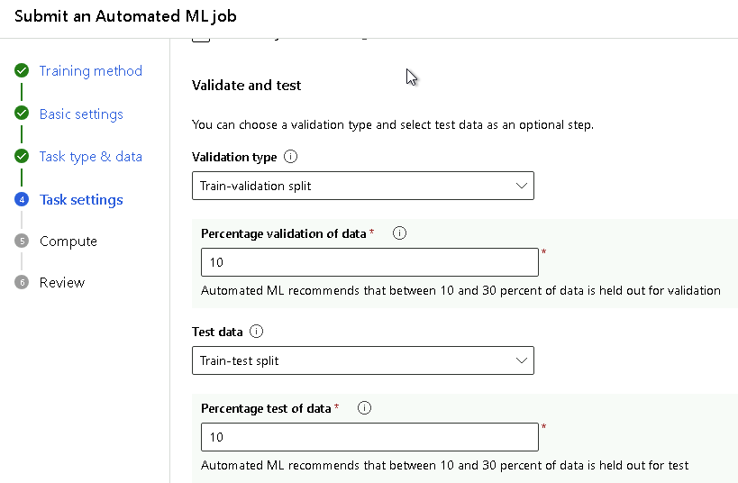
   
   #### 2.4. Compute cluster
   - A compute cluster is needed to run the automated ml models.
     - Standard_DS2_v2 is selected as optimal performance
     - minimum number of nodes is set to 1 as expected from the objectives of the project
     - maximum number of nodes is set to 6 at least for 5 concurrent runs

       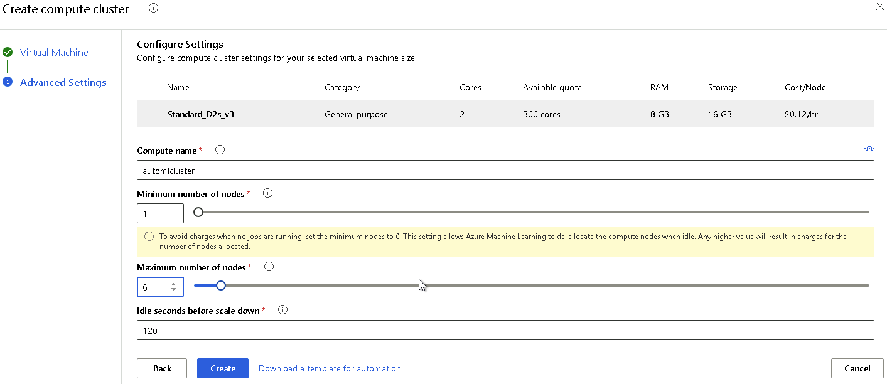
   
   #### 2.5. Submit the job
   - After a final review of all automl settings, the job is submitted
    
     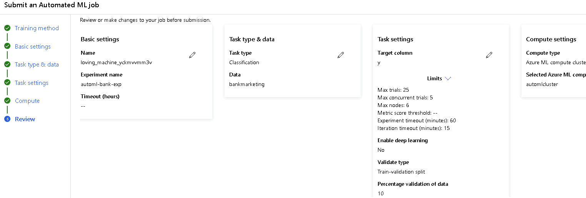
    
   #### 2.6. Finding best model
   - As a result of submitted job, the best performing model is provided as VotingEnsemble shown below.

     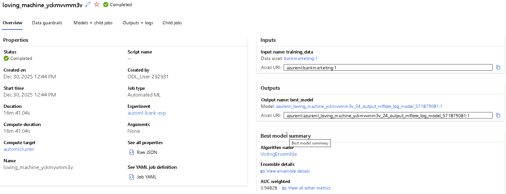
    
### 3. Deployment of the Best Model
   - Starting a deployment as a web service
     The deployment of the best model is started by selecting the followng settings
     - Define a name for the deployment. I named it as "bestmodeldeploy".
     - Compute type is selected as ACI
     - Authentication is enabled

       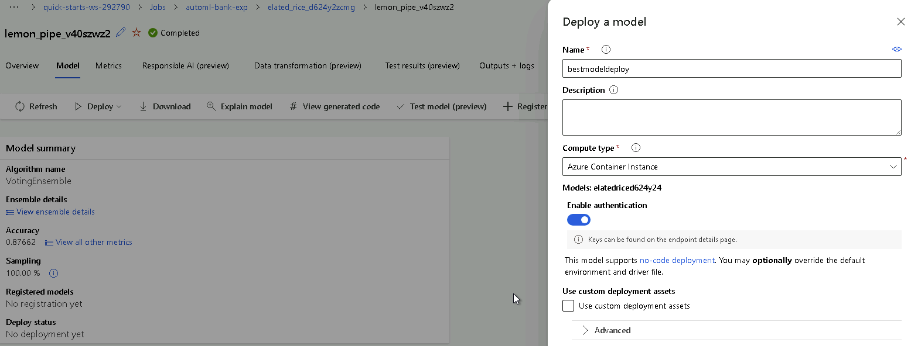

   - Deployment is succeeded.
     
     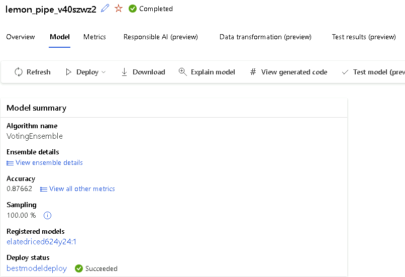

   - Application insights is disabled.

     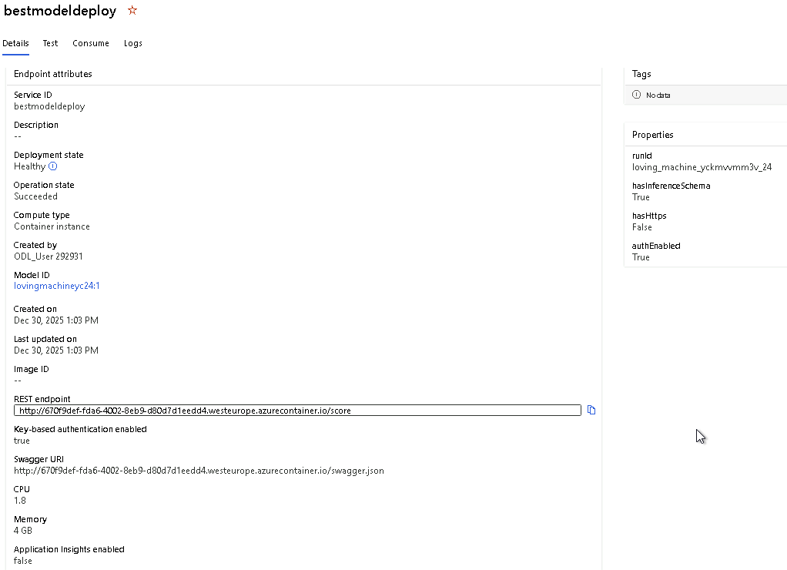

### 4. Enabling Logging

- log.py is updated to enable Application insights by modifiying the deployment name to "bestmodeldeploy"

  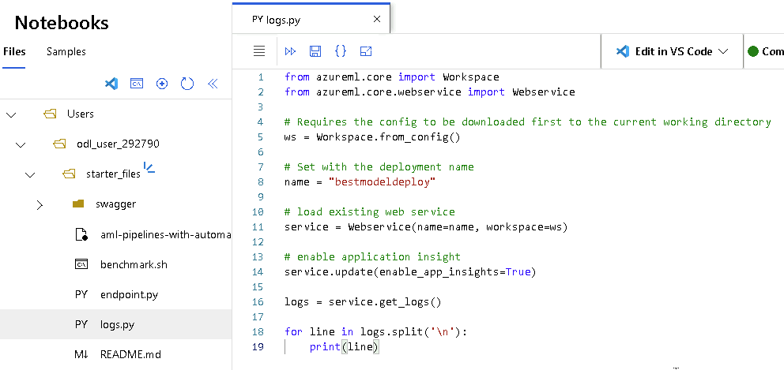

- Application insights is now enabled after running log.py

  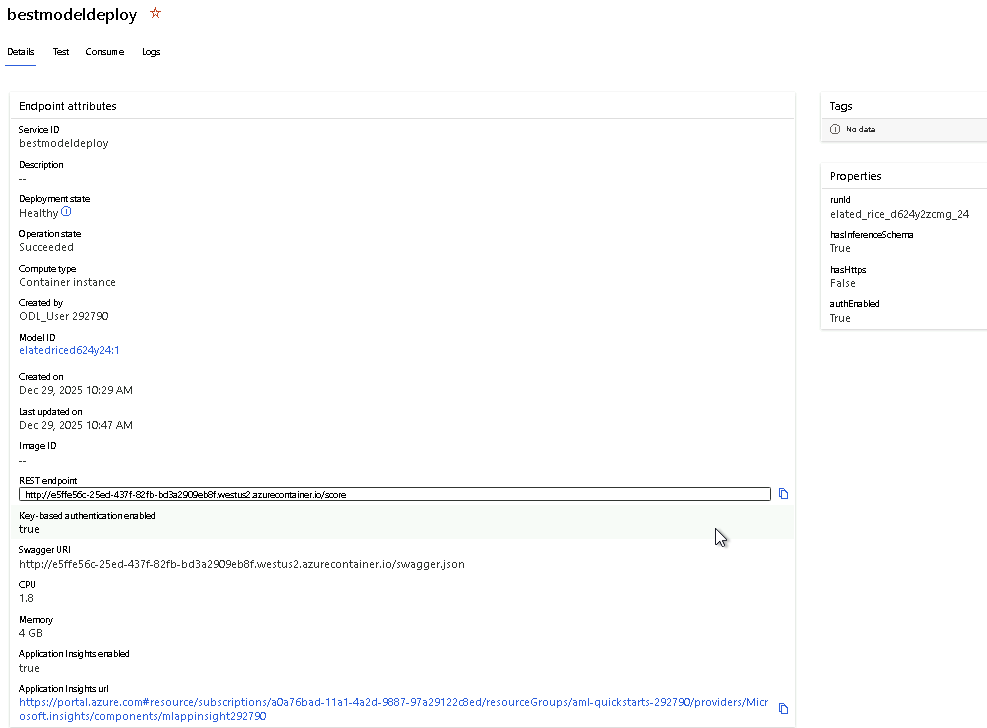

### 5. Consume Model Points
This section describes how the deployed machine learning model is accessed and tested
through its REST API endpoint.

   #### 5.1. Downloading swagger.json file
   After the model is successfully deployed, Azure Machine Learning automatically generates a `swagger.json` file that describes the REST API interface of the deployed service.
   This file contains details about the available endpoints, request and response schemas, and input data formats.

   The `swagger.json` file is downloaded from the Azure Machine Learning Studio and can be used to visualize and test the model endpoint using tools such as Swagger UI.
   This step helps verify that the endpoint is functioning correctly and that requests are formatted as expected.
   
   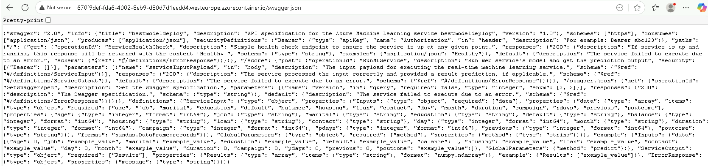

   #### 5.2. Running swagger.sh file
   The `swagger.sh` script is used to launch a local instance of **Swagger UI** to interactively explore and test the deployed model endpoint.
   Originally, port 80 was used, but it was changed to 9000
   
   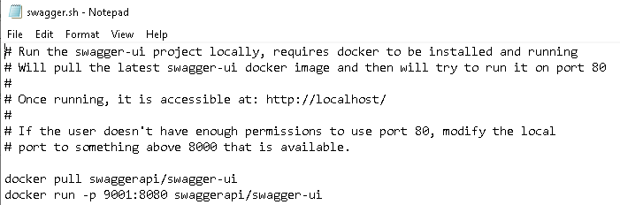

   To run the script, the following command is executed in **Git Bash**:
   bash swagger.sh
   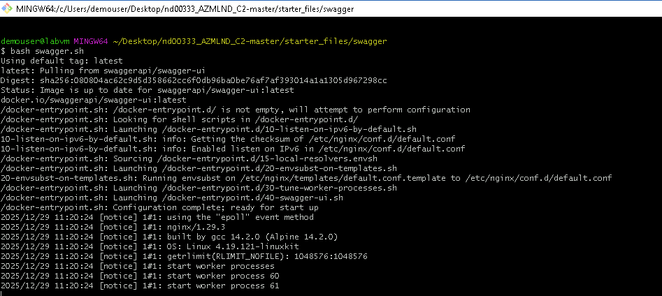

   #### 5.3. Running serve.py file

   To run the script, the following command is executed in **Git Bash**:
   python serve.py
   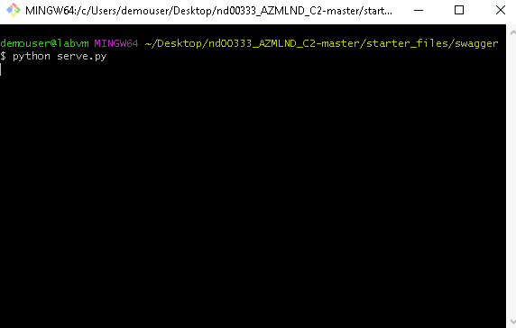

   #### 5.4. Swagger UI
   
   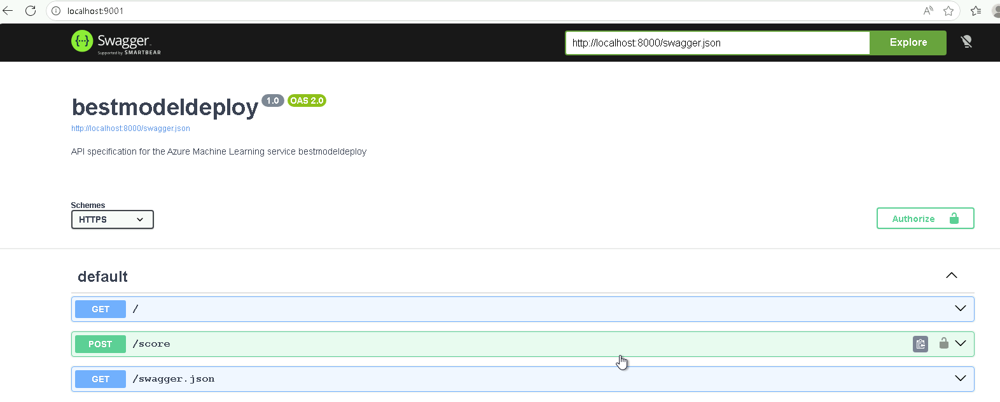
   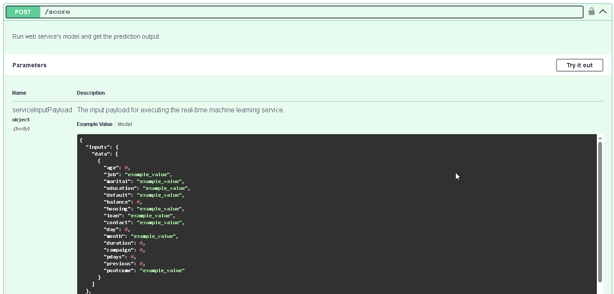
   
   #### 5.5. Running endpoint.py file
   
   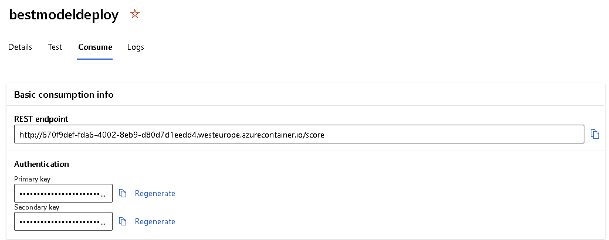
   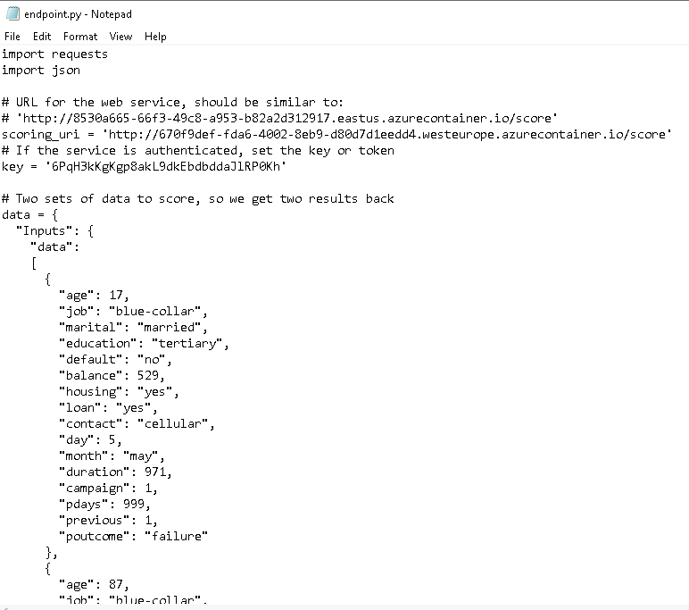
   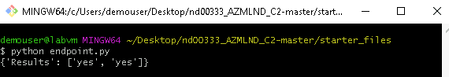
  
### 6. Create and Publish a Pipeline

## Screen Recording
Due to company policy restrictions, screen recording is not permitted in the working environment.  
Therefore, a screen recording of the project execution cannot be provided.

The project functionality and workflow are instead demonstrated through detailed screenshots
and step-by-step explanations throughout this README.

## Standout Suggestions
*TODO (Optional):* This is where you can provide information about any standout suggestions that you have attempted.
