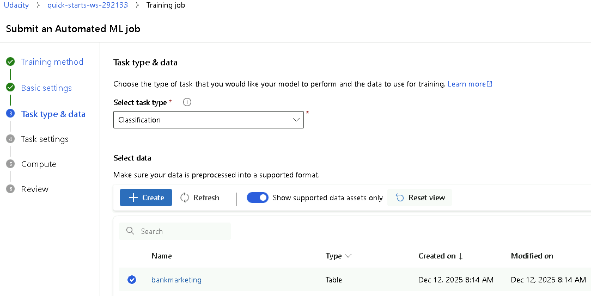
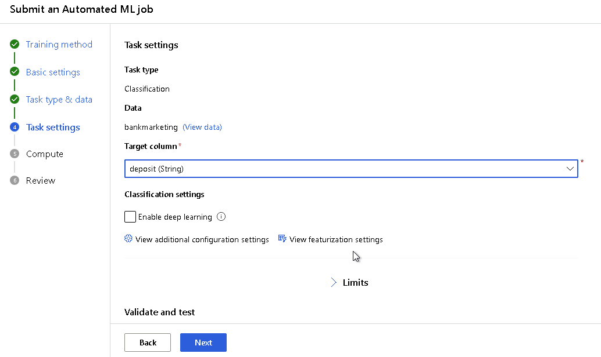
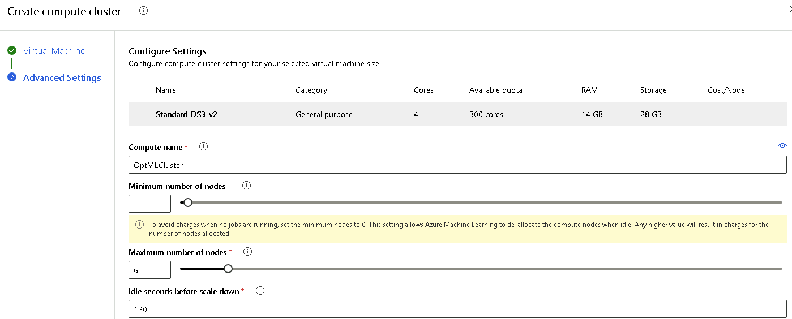
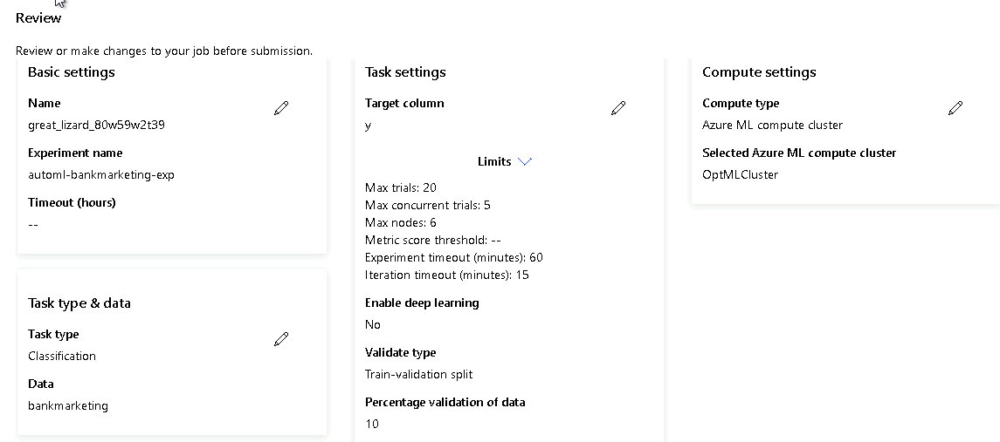
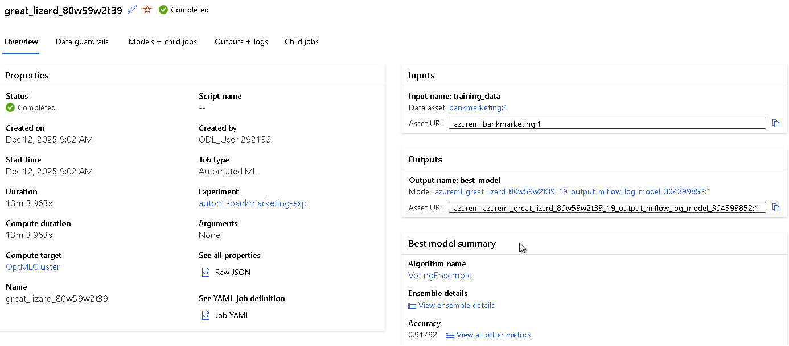
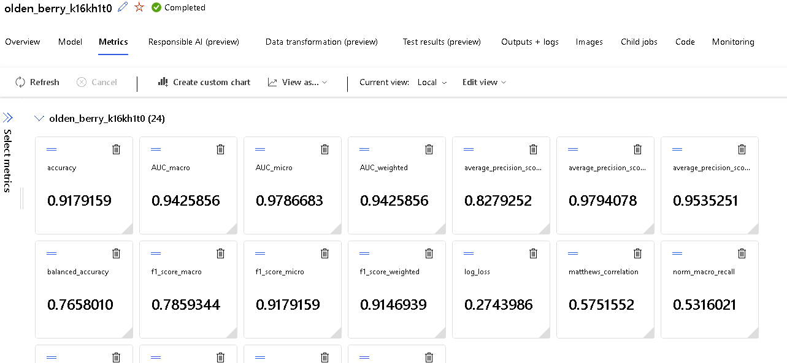
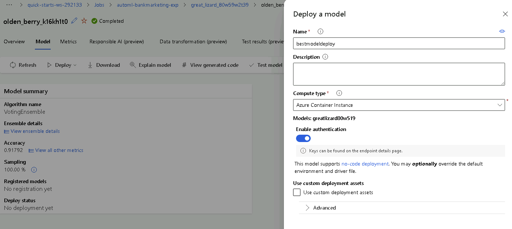

# Operationalizing Machine Learning

In this project, a cloud-based machine learning production model is configured, deployed, and consumed in Azure. Furthermore a pipeline is created, published, and consumed.
A bank marketing dataset from https://archive.ics.uci.edu/dataset/222/bank+marketing is used for the model training.

## Architectural Diagram
The following steps are performed:

1. Authentication
2. Automated ML Experiment
3. Deploy the best model
4. Enable logging
5. Swagger Documentation
6. Consume model endpoints
7. Create and publish a pipeline
8. Documentation

*TODO*: Provide an architectual diagram of the project and give an introduction of each step. An architectural diagram is an image that helps visualize the flow of operations from start to finish. In this case, it has to be related to the completed project, with its various stages that are critical to the overall flow. For example, one stage for managing models could be "using Automated ML to determine the best model". 

## Key Steps
*TODO*: Write a short discription of the key steps. Remeber to include all the screenshots required to demonstrate key steps. 
1. Authentication
The lab Udacity is used to complete the project. Therefore this step is skipped since I am not authorized to create a security principal. 

2. Automated ML Experiment
Azure Machine Learning GUI is used to create a new automated ML run.
2.1 Basic settings
Experiment name is defined at the step of "Basic Settings"

2.2 Task type and data
Task type is selected as classification.
The data asset is registered by locally uploading the csv file from https://archive.ics.uci.edu/dataset/222/bank+marketing 

2.2 Task settings
The target column is selected as "y"

Additional configuration settings is done by 
selecting "Primary metric" as "Accuracy"
checking "Explain best model" is enabled

Limits are set as follows:
max trials = 20
max concurrent trials = 5 as expected from the objectives of the project
max nodes = 5
experiment timeout = 60 mins (1 hours) as expected from the objectives of the project
iteration timeout = 15 as minumum recommended duration by Azure ML studio

Validate and test data section are configured as explained in the related lesson
Validation type is selected as Train-validation split with 10%
Test data is selected as Train-test split with 10%

2.3 Compute cluster
A compute cluster is needed to run the automated ml models.
Standard_DS2_v2 is selected as optimal performance
minimum number of nodes is set to 1 as expected from the objectives of the project
maximum number of nodes is set to 6 at least for 5 concurrent runs

2.4 Submit the job
After a final review of all automl settings, the job is submitted

2.5 Finding best model
As a result of submitted job, the best performing model is provided as VotingEnsemble shown below.

The metrics of the best model is reviewed

2.6 Deployment of the best model
The deployment of the best model is started by selecting the followng settings
Compute type is selected as ACI
Authentication is enabled

## Screen Recording
*TODO* Provide a link to a screen recording of the project in action. Remember that the screencast should demonstrate:

## Standout Suggestions
*TODO (Optional):* This is where you can provide information about any standout suggestions that you have attempted.
